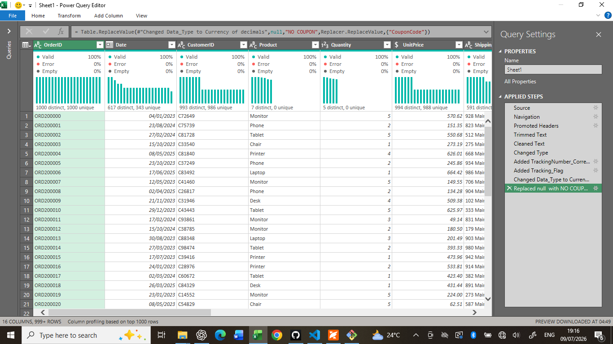
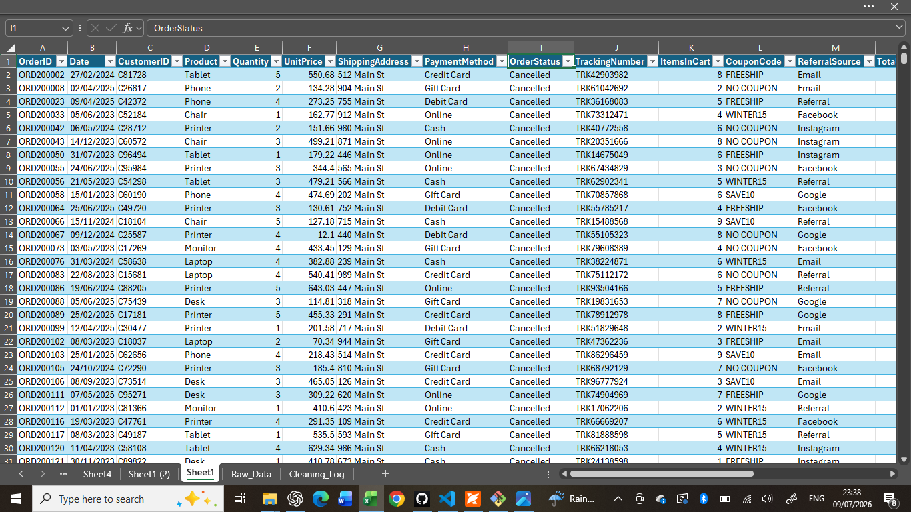

# E-Commerce Data Cleaning Using Power Query

## 📑 Table of Contents

- [Project Overview](#project-overview)
- [Objectives](#objectives)
- [Key Highlights](#key-highlights)
- [Dataset](#dataset)
- [Data Quality Issues Identified](#data-quality-issues-identified)
- [Data Cleaning Process](#data-cleaning-process)
- [Tools Used](#tools-used)
- [Skills Demonstrated](#skills-demonstrated)
- [Project Structure](#project-structure)
- [Project Files](#project-files)
- [Data Cleaning Flow](#data-cleaning-flow)
- [Outcome](#outcome)
- [Conclusion](#conclusion)
- [Author](#author)


## Project Overview

This project demonstrates an end-to-end data cleaning workflow using **Microsoft Excel Power Query**. The objective was to transform a messy dataset into a clean, consistent, and analysis-ready dataset by addressing common data quality issues. The project follows a structured and reproducible workflow, ensuring the final dataset is reliable and ready for analysis, reporting, or dashboard development.


## Objectives

- Improve overall data quality.
- Prepare the dataset for analysis and reporting.
- Demonstrate practical data cleaning techniques using Power Query.
- Produce an analysis-ready dataset.


## Key Highlights

- Cleaned a real-world dataset using Microsoft Excel Power Query.
- Resolved missing values.
- Removed blank rows.
- Trimmed and cleaned text fields.
- Corrected incorrect data types.
- Standardized text capitalization.
- Produced a clean and analysis-ready dataset.


## Dataset

The project contains two versions of the dataset:

- **Raw Dataset** – The original dataset before cleaning.
- **Cleaned Dataset** – The transformed dataset after all cleaning operations.


## Data Quality Issues Identified

The following issues were identified in the original dataset:

- Missing values
- Blank rows
- Leading and trailing spaces
- Incorrect data types
- Inconsistent text capitalization


## Data Cleaning Process

The following transformations were performed using **Microsoft Excel Power Query**:

- Imported the raw dataset.
- Removed blank rows.
- Trimmed and cleaned text fields.
- Corrected incorrect data types.
- Handled missing values where appropriate.
- Standardized text capitalization.
- Loaded the cleaned dataset back into Excel.


## Tools Used

- Microsoft Excel
- Power Query
- Git
- GitHub


## Skills Demonstrated

- Data Cleaning
- Data Transformation
- Data Wrangling
- Data Quality Assessment
- ETL with Power Query
- Microsoft Excel
- Git Version Control
- GitHub


## Project Structure

```text
customer-data-cleaning/
│
├── data/
│   ├── raw/
│   │   └── E-Commerce_Data_Raw.xlsx
│   │
│   └── cleaned/
│       └── E-Commerce_Data_Clean.xlsx
│
├── power-query/
│   └── Data_Cleaning_Steps.pq
│
├── images/
│   ├── hidden-work-data-analyst.png
│   ├── raw_dataset.png
│   ├── power_query_editor.png
│   └── cleaned_dataset.png
│
├── README.md
├── LICENSE
└── .gitignore
```

## Project Files

- 📄 [Raw Dataset](Datasets/Raw_Data.xlsx)
- 📄 [Cleaned Dataset](data/cleaned/Customer_Data_Clean.xlsx)

# Data Cleaning Workflow

## 1. Raw Dataset

The original dataset before any transformations were performed. The dataset contained several data quality issues that required cleaning before it could be used for analysis.


## 2. Power Query Transformations

The dataset was transformed using **Microsoft Excel Power Query**. The **Applied Steps** pane documents each transformation, making the cleaning process transparent, repeatable, and easy to audit.


## 3. Cleaned Dataset

After completing all transformations, the dataset became clean, consistent, and ready for analysis, reporting, and visualization.




## Outcome

The project successfully transformed a raw dataset into a clean, reliable, and analysis-ready dataset using Microsoft Excel Power Query. The cleaning process improved data quality, consistency, and usability, providing a solid foundation for future analysis and business reporting.


## Conclusion

This project demonstrates my ability to identify, assess, and resolve common data quality issues using Microsoft Excel Power Query. It reflects a structured approach to data preparation and highlights the importance of clean data in producing accurate insights.


## Author

**Godstime Okoene**

Aspiring Data Analyst passionate about transforming raw data into reliable, analysis-ready datasets using Microsoft Excel and Power Query.

### Connect with Me

- **LinkedIn:** https://www.linkedin.com/in/godstime-osebhahiemen
- **GitHub:** https://github.com/GGStyles/DecodeLabs-Internship